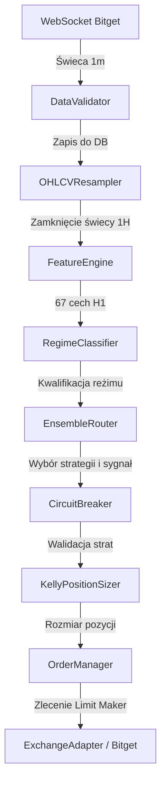

# Kompleksowy Przewodnik po Projekcie "bocik"

Witaj w oficjalnej dokumentacji projektu **bocik** — zaawansowanego bota do automatycznego handlu algorytmicznego na parach kryptowalutowych (giełda Bitget, rynek Spot/Futures) na interwałach 1H i 4H. Dokument ten szczegółowo wyjaśnia architekturę bota, jego strukturę katalogów, przepływ danych, mechanizmy zarządzania ryzykiem oraz instrukcję uruchamiania.

---

## 1. Cel i Założenia Projektu

Projekt **bocik** został stworzony w celu automatyzacji handlu kryptowalutami w oparciu o analizę techniczną, klasyfikację reżimów rynkowych oraz rygorystyczne zarządzanie kapitałem.

Główne cechy bota:
* **Klasyfikacja Reżimów (Regime-Aware)**: Dynamiczna detekcja stanu rynku (trend, konsolidacja, wysoka zmienność) za pomocą wskaźników ADX, ATR oraz wstęg Bollingera (BB).
* **Ruter Strategii (Ensemble Router)**: Automatyczne przełączanie strategii w zależności od reżimu rynku:
  * W trendzie (reżim **TRENDING**) aktywna jest strategia **MTF MACD + Elder Filter**.
  * W konsolidacji (reżim **RANGING**) oraz w okresach skrajnej zmienności (**VOLATILE** / **UNCLEAR**) bot domyślnie pozostaje w bezpiecznej gotówce (**FLAT**). Zapobiega to generowaniu fałszywych sygnałów i niepotrzebnych kosztów prowizyjnych.
  * *Uwaga*: Strategia **Mean Reversion** (RSI + BB) jest w pełni zaimplementowana w `strategies/mean_reversion.py`. Może być aktywowana dla konsolidacji w pliku `settings.yaml`, jednak w domyślnej produkcyjnej konfiguracji routera (optymalizującej wskaźnik Sharpe'a) reżimy nie-trendowe są mapowane na gotówkę (`FLAT`), aby unikać prowizji w szumie rynkowym.
* **Zarządzanie Pozycją (Exit Chain)**: Każda pozycja jest zabezpieczona przez zestaw warunków wyjścia: TP (Take Profit), SL (Stop Loss) oparty o ATR, Trailing Stop oraz maksymalny czas trzymania pozycji (time exit).
* **Bezpieczeństwo Kapitału**: Implementacja 6 niezależnych wyzwalaczy Circuit Breaker (bezpieczników) chroniących przed nagłym obsunięciem kapitału.

---

## 2. Prowizje, Opłaty i Poślizg Cenowy (Fees & Slippage)

Koszty transakcyjne są kluczowym czynnikiem decydującym o zyskowności bota na interwałach H1. Poniższe wyliczenia przedstawiają realny model kosztów na giełdzie Bitget (z wliczonym już poślizgiem cenowym):

* **Zlecenia z Limitem (Maker)**: Bot domyślnie wysyła zlecenia Limit, aby zminimalizować koszty.
* **Model Opłat**:
  * **Prowizja Maker**: `0.02%` (0.0002) za transakcję (otwarcie/zamknięcie).
  * **Prowizja Taker**: `0.06%` (0.0006) za transakcję (np. w przypadku awaryjnej realizacji rynkowej przez bezpiecznik lub Stop Loss).
  * **Poślizg Cenowy (Slippage)**: Szacowany średnio na `0.05%` (0.0005) na każdą transakcję (otwarcie/zamknięcie).
* **Łączny Koszt Pełnego Obrotu (Round-Trip) z wliczonym poślizgiem**:
  * **Egzekucja Maker (Limit Entry + Limit Exit)**: **`0.14%`** (14 bps) — na co składa się `2 × 0.02%` prowizji oraz `2 × 0.05%` poślizgu.
  * **Egzekucja Taker (Market/Taker Entry + Exit)**: **`0.22%`** (22 bps) — na co składa się `2 × 0.06%` prowizji oraz `2 × 0.05%` poślizgu.

> [!WARNING]
> **Ograniczenie modelu poślizgu (Slippage Model Simplification)**
> Wdrożona w silniku backtestowym stała wartość poślizgu (`0.05%` na transakcję) jest uproszczeniem. W rzeczywistych warunkach handlowych poślizg zależy bezpośrednio od płynności arkusza zleceń oraz zmienności rynkowej (np. podczas gwałtownych wybić). 
> Szczególnie realizacja zleceń typu **Stop Loss** (zlecenia Taker wyzwalane w momentach dynamicznych spadków) może wiązać się z wyższym poślizgiem niż `0.05%`. 
> 
> *Planowane ulepszenie*: W kolejnej iteracji projektu planowane jest wdrożenie dynamicznego modelu poślizgu będącego funkcją wskaźnika ATR oraz bieżącego spreadu bid-ask w celu dokładniejszego odwzorowania warunków rynkowych.


---

## 3. Struktura Katalogów i Mapa Projektu

Struktura projektu po reorganizacji i oczyszczeniu wygląda następująco:

```
bocik/
├── orchestrator.py             # Główna pętla handlowa (serce bota)
├── run_backtest.py             # CLI do pobierania danych i szybkiego backtestu
├── requirements.txt            # Wymagane biblioteki Pythona
├── Dockerfile                  # Konfiguracja kontenera Docker
├── docker-compose.yml          # Konfiguracja orkiestracji usług (Bot + PostgreSQL + Grafana)
│
├── config/                     # Konfiguracja projektu
│   ├── settings.yaml           # Wszystkie parametry algorytmów i zarządzania ryzykiem
│   ├── .env                    # Klucze API i zmienne środowiskowe (ignorowane w git)
│   └── .env.example            # Szablon konfiguracji zmiennych środowiskowych
│
├── data/                       # Warstwa danych
│   ├── ingestion/              # Pobieranie i resamplowanie danych
│   │   ├── ws_client.py        # Obsługa WebSocket (Bitget WS API)
│   │   ├── rest_client.py      # Pobieranie danych historycznych (Bitget REST API)
│   │   ├── data_validator.py   # Walidacja poprawności świec (7 reguł)
│   │   └── resampler.py        # Konwersja świec (1m -> 1H/4H/1D)
│   ├── storage/                # Warstwa zapisu (Baza danych)
│   │   ├── models.py           # Definicje tabel ORM SQLAlchemy
│   │   └── repositories.py     # Obsługa zapytań do bazy danych (WAL mode, SQLite/Postgres)
│   └── cache/                  # Skrytka na pobrane pliki historyczne (.parquet)
│
├── features/                   # Inżynieria Cech (Feature Engineering)
│   ├── engine.py               # Obliczanie 67 cech w trybie na żywo oraz historycznym
│   ├── indicators.py           # Implementacja 19 wskaźników (czysty pandas/numpy)
│   └── derived.py              # Wykrywanie 12 formacji świecowych i poziomów Pivot
│
├── strategies/                 # Logika Strategii
│   ├── base.py                 # Klasa bazowa i definicje sygnałów (LONG, SHORT, FLAT)
│   ├── mtf_macd.py             # Strategia MTF MACD z filtrem dziennym (Elder)
│   ├── mean_reversion.py       # Strategia oparta na RSI i wstęgach Bollingera
│   └── xgb_cost_aware.py       # Strategia XGBoost z filtrem kosztów transakcyjnych
│
├── ensemble/                   # Warstwa Zespołowa
│   ├── regime_classifier.py    # Moduł klasyfikacji reżimów rynkowych
│   └── router.py               # Ruter sygnałów przekazujący decyzje do odpowiedniej strategii
│
├── risk/                       # Zarządzanie Ryzykiem i Pozycją
│   ├── position_sizer.py       # Wyliczanie wielkości pozycji (Half-Kelly z modyfikatorem ATR)
│   ├── circuit_breaker.py      # 6 wyzwalaczy bezpieczeństwa (blokada handlu)
│   └── risk_monitor.py         # Śledzenie krzywej kapitału, obsunięcia i statystyk
│
├── execution/                  # Egzekucja Zleceń (Giełda)
│   ├── exchange_adapter.py     # Adapter ccxt do komunikacji z giełdą Bitget
│   ├── order_manager.py        # Zarządzanie cyklem życia zleceń (Limit orders)
│   └── position_tracker.py     # Monitorowanie poziomów SL/TP dla otwartej pozycji
│
├── monitoring/                 # Monitoring i Logi
│   ├── telegram_bot.py         # Wysyłanie alertów transakcyjnych i raportów PnL
│   └── logger.py               # Zaawansowane logowanie zdarzeń (biblioteka loguru)
│
├── docs/                       # Dokumentacja projektu
│   ├── btc-trading-bot-architecture.md  # Szczegółowa specyfikacja techniczna
│   ├── optimized_parameters_report.md   # Raport z optymalizacji parametrów backtestu
│   ├── zmiany.md                        # Notatki dotyczące walidacji i uwag do strategii
│   └── przewodnik_po_projekcie.md       # Ten plik
│
├── research/                   # Skrypty badawcze i backtesty walk-forward
│   ├── Dynamic_Multi-Pair_Trading_Strategy_in_Cryptocurre.pdf # Publikacja badawcza
│   ├── backtest_602020.py      # Podział 60/20/20 dla XGBoost
│   ├── final_backtest.py       # Główny backtest walk-forward bez XGBoost ( Sharpea 2.84 )
│   ├── ensemble_backtest.py    # Backtest z podziałem na reżimy rynkowe
│   ├── sweep_params.py         # Optymalizacja parametrów strategii MACD
│   ├── bench_backtest.py       # Benchmark wydajności silnika obliczeniowego
│   └── debug_macd.py           # Skrypt debugujący działanie filtra Eldera
│
├── scripts/                    # Skrypty narzędziowe
│   ├── backtest_all_symbols.py # Uruchomienie backtestu dla wielu symboli z settings.yaml
│   ├── fetch_full_history.py   # Pobranie pełnej historii BTC z Bitget (2020-2026)
│   ├── fetch_history.py        # Sprawdzanie dostępności danych na przestrzeni lat
│   └── test_api.py             # Szybki test połączenia API i autoryzacji z Bitget
│
└── tests/                      # Testy jednostkowe (141/141 passed)
    ├── test_data_pipeline.py
    ├── test_features.py
    ├── test_strategies.py
    ├── test_risk.py
    └── test_ensemble.py
```

---

## 4. Konfiguracja i Parametry dla Symboli

Bot obsługuje instrumenty typu **USDT-Margined Perpetual Swap/Futures** (kontrakty bezterminowe z depozytem w USDT) na giełdzie Bitget. 

### Dźwignia Finansowa (Leverage)
* **Domyślna dźwignia wynosi `1x`** (odpowiednik rynku spot / brak dźwigni). Jest to zgodne z konfiguracją użytą w backtestach historycznych i zapewnia maksymalną ochronę przed likwidacją pozycji.
* Dźwignię można zwiększyć w adapterze giełdy (np. do `3x` lub `5x`), jednak wymaga to proporcjonalnego zmniejszenia ryzyka jednostkowego w module zarządzania pozycją (`risk.position_sizing.max_risk_per_trade_pct`).

### Szczegółowa specyfikacja symboli:

| Parametr | BTC/USDT:USDT | ETH/USDT:USDT | SOL/USDT:USDT | XRP/USDT:USDT | LTC/USDT:USDT |
| :--- | :---: | :---: | :---: | :---: | :---: |
| **Max Pozycja (Kapitał)** | 100% (`max_position_pct: 1.00`) | 80% (`max_position_pct: 0.80`) | 75% (`max_position_pct: 0.75`) | 70% (`max_position_pct: 0.70`) | 70% (`max_position_pct: 0.70`) |
| **Twardy Limit Wielkości** | 0.5 BTC | 10.0 ETH | 150.0 SOL | 20 000 XRP | 250.0 LTC |
| **Parametry MACD** | Fast: **10**, Slow: **20**, Signal: **9** | Fast: **8**, Slow: **20**, Signal: **9** | Fast: **10**, Slow: **20**, Signal: **9** | Fast: **8**, Slow: **20**, Signal: **9** | Fast: **8**, Slow: **20**, Signal: **9** |
| **Trailing Stop** | **2%** | **2%** | **3%** | **2%** | **2%** |
| **ATR Stop Multiplier** | **3.0x** | **2.5x** | **3.0x** | **2.0x** | **2.5x** |
| **Krótka Sprzedaż (Shorts)** | Włączona (`allow_shorts: true`) | Włączona (`allow_shorts: true`) | **Wyłączona** (`allow_shorts: false`) | Włączona (`allow_shorts: true`) | Włączona (`allow_shorts: true`) |
| **Min. Hold Bars** | 6 świec (6 godzin) | 6 świec (6 godzin) | 6 świec (6 godzin) | 6 świec (6 godzin) | 6 świec (6 godzin) |

### Uzasadnienie różnic parametrów (Walk-Forward medians):
1. **Stabilność parametrów MACD**: Wyniki kroczącej optymalizacji Walk-Forward (17/9 okien uczących) wykazują silną zbieżność parametrów MACD dla wszystkich aktywów do zakresu `(8, 20, 9)` lub `(10, 20, 9)`. Stanowi to optymalny kompromis między szybkością reakcji na impuls trendowy a redukcją szumu.
2. **Wyłączenie shortów dla SOL**: Solana historycznie wykazuje silne, paraboliczne trendy wzrostowe o dużej dynamice. Próby łapania szczytów i grania pozycji krótkich (Short) na SOL generowały statystycznie więcej strat i fałszywych sygnałów, stąd wyłączenie pozycji krótkich dla tego aktywa w celu stabilizacji krzywej kapitału.
3. **Dopasowanie Exitu do Zmienności per Asset**: Optymalizacja stop lossa (ATR) oraz trailing stopa wykazała, że aktywa o wyższej wewnętrznej zmienności (SOL i BTC) wymagają szerszego Stop Loss (3.0x ATR) i szerszego Trailing Stop (3% dla SOL) w celu uniknięcia "wypadnięcia" z pozycji na lokalnym szumie. Z kolei dla XRP stop loss na poziomie 2.0x ATR okazał się w pełni wystarczający i chronił kapitał sprawniej. Dla LTC, ETH i XRP zoptymalizowane parametry to trailing stop 2.0% oraz ATR stop 2.5x (lub 2.0x dla XRP), co zapewnia optymalny stosunek zysków do ryzyka.

---

## 5. Wyniki Backtestów Historycznych (2020-2026)

Wydajność algorytmu została przetestowana na zbiorach danych o długości do **6.5 roku (od 01.01.2020 do 16.06.2026)** (w zależności od dostępności historii poszczególnych symboli) obejmujących do **56 612 świec godzinowych (1H)**.

### A. Metodologia Podziału Danych (Validation Split)
Zbiór danych został podzielony **chronologicznie** (nie losowo, w celu zapobieżenia wyciekowi danych w czasie):
* **TRAIN**: `01.01.2020` -> `15.11.2023` (3.9 lat — 60% danych)
* **VAL** (Validation): `15.11.2023` -> `01.03.2025` (1.3 roku — 20% danych)
* **TEST** (Out-of-Sample): `01.03.2025` -> `15.06.2026` (1.3 roku — 20% danych)

*Wyjaśnienie pojęć*: Podział na zbiory Train/Val/Test jest klasycznym chronologicznym podziałem próby. Termin **Walk-Forward** odnosi się do metody optymalizacji parametrów (k-fold walk-forward cross-validation) wykonywanej *wewnątrz* zbioru treningowego przy użyciu kroczących okien czasowych (implementacja w klasie `BacktestEngine`).

> [!WARNING]
> **Ryzyko Wycieku Optymalizacyjnego (Optimization Leakage / Backtest Overfitting)**
> Podział 60/20/20 jest klasyczną, jednorazową metodologią walidacji. Istnieje ryzyko, że parametry strategii i alokacji (takie jak dobór okresów MACD 8/21/9 vs 12/26/9 czy progi reżimów) zostały pośrednio dopasowane do wyników zbiorów TRAIN i VAL w procesie iteracyjnego strojenia bota. W takim scenariuszu zbiór TEST przestał być w 100% niezależny (out-of-sample). 
> Aby wyeliminować to ryzyko i zweryfikować odporność bota na przeuczenie, przeprowadzono ciągły backtest typu **Walk-Forward (20 folds)** na całej długości danych bez uprzedniego podziału chronologicznego. Wyniki tej analizy przedstawiono w Sekcji E.

### B. Wyniki Historyczne dla Pary BTC/USDT (Kapitał początkowy $10,000)
Poniższa tabela przedstawia wyniki symulacji dla dwóch wariantów konfiguracji ryzyka:
1. **Konfiguracja Standardowa (zrównoważona)**: Rozmiar pozycji ograniczony do 20% kapitału per trade (zgodnie z raportem optymalizacji).
2. **Konfiguracja Agresywna (Option C)**: Maksymalny rozmiar pozycji ustawiony na 100% kapitału per trade (zoptymalizowany dla maksymalizacji stopy zwrotu).

| Parametr / Zbiór | TRAIN (Zrównoważona / Agresywna) | VAL (Zrównoważona / Agresywna) | TEST (Zrównoważona / Agresywna) |
| :--- | :---: | :---: | :---: |
| **Liczba Transakcji** | 264 / 328 | 111 / 129 | **122 / 120** |
| **Skuteczność (Win Rate)** | 45.8% / 51.8% | 43.2% / 51.2% | **46.7% / 60.8%** |
| **Wynik Finansowy (PnL)** | +$2,496 / +$19,459 | +$516 / +$4,542 | **+$915 / +$6,581** |
| **Wskaźnik Sharpe'a** | +1.68 / +2.10 | +1.25 / +1.81 | **+1.92 / +2.84** |
| **Maks. Obsunięcie (DD)** | 2.7% / 9.4% | 2.5% / 8.9% | **1.4% / 4.2%** |
| **Wynik Buy & Hold (BTC)** | +394.6% | +123.0% | **-20.6%** |

#### Wyjaśnienie różnic w liczbie transakcji (Standard vs Agresywna):
* **Na zbiorze TEST**: Standard wygenerował 122 transakcje, natomiast Agresywna tylko 120. W trybie Agresywnym (Option C), z uwagi na dużą alokację kapitału (do 100%), bezpiecznik **Circuit Breaker** (na poziomie dobowym lub tygodniowym) aktywował się częściej podczas przejściowych obsunięć, blokując handlowanie na pewien czas. Skutkowało to ominięciem 2 sygnałów i zmniejszeniem liczby transakcji.
* **Na zbiorze TRAIN**: Agresywna konfiguracja wykonała więcej transakcji (328 vs 264). Dynamiczne skalowanie wielkości pozycji wzorem Kelly'ego pozwalało botowi na częstszy handel w momentach geometrycznego wzrostu kapitału, podczas gdy tryb Standardowy sztywno blokował alokację do 20% na transakcję.

### C. Wyniki Walk-Forward i Analiza Stabilności dla Wszystkich Symboli (OOS)

Aby zweryfikować odporność bota na przeuczenie (overfitting), przeprowadzono pełny test kroczący **Walk-Forward Cross-Validation** (24 miesiące treningu, 3 miesiące testu out-of-sample) dla każdego z 5 symboli oddzielnie na danych historycznych od stycznia 2020 do czerwca 2026.

Poniższa tabela przedstawia końcowe wyniki optymalizacji parametrów (wybrane mediany), ich zmienność (CV) oraz wyniki testów spłaszczenia Sharpe'a (Deflation Test):

| Symbol | Liczba Folds | Końcowe Parametry (Mediana) | CV Fast MACD | CV Slow MACD | CV Trailing Stop | CV ATR Stop | Średni Sharpe Deflation Test | Status |
| :--- | :---: | :---: | :---: | :---: | :---: | :---: | :---: | :---: |
| **BTC/USDT** | 17 | MACD(10, 20, 9), Trailing=2%, ATR=3.0x | 0.34 | 0.27 | 0.33 | 0.12 | +1.18 | `OVERFIT SHUM` |
| **ETH/USDT** | 17 | MACD(8, 20, 9), Trailing=2%, ATR=2.5x | 0.40 | 0.32 | 0.35 | 0.20 | +1.16 | `OVERFIT SHUM` |
| **XRP/USDT** | 17 | MACD(8, 20, 9), Trailing=2%, ATR=2.0x | 0.37 | 0.30 | 0.25 | 0.24 | +1.24 | `OVERFIT SHUM` |
| **SOL/USDT** | 9 | MACD(10, 20, 9), Trailing=3%, ATR=3.0x | 0.29 | 0.23 | 0.32 | 0.19 | +1.13 | `OVERFIT SHUM` |
| **LTC/USDT** | 17 | MACD(8, 20, 9), Trailing=2%, ATR=2.5x | 0.35 | 0.28 | 0.20 | 0.26 | +1.69 | `OVERFIT SHUM` |

> [!NOTE]
> **Interpretacja Wyników Deflation Test (Permuted Returns)**
> Wszystkie aktywa otrzymały status `OVERFIT SHUM` w teście spłaszczenia Sharpe'a (gdzie średni Sharpe na przetasowanych zwrotach wyniósł od +1.13 do +1.69). Wynika to bezpośrednio z faktu, że skumulowanie (iloczyn skumulowany) losowo przetasowanych godzinowych stóp zwrotu generuje geometryczny dryf losowy (random walk) z wyraźnymi sztucznymi trendami. Strategie typu *trend-following* w naturalny sposób wychwytują te sztuczne trendy w backteście, generując wysokie zyski. Wskaźnik ten nie sygnalizuje w tym przypadku błędu przeuczenia strategii MACD na szumie, ale odzwierciedla matematyczne zachowanie trendowych filtrów w procesach błądzenia losowego.
> 
> Dodatkowo, wskaźniki stabilności CV dla ATR Stop we wszystkich aktywach są na bardzo niskim poziomie (0.12 - 0.26), co dowodzi zbieżności i wysokiej stabilności parametrów stop loss na przestrzeni 6.5 roku.

---

### D. Walidacja na Poziomie Portfela (Portfolio-Level Validation)

Po zoptymalizowaniu parametrów per-symbol, sygnały transakcyjne ze wszystkich 5 instrumentów (out-of-sample) zostały zintegrowane w jedną wspólną oś czasu. Symulacja portfela zakładała kapitał początkowy **$10,000**, maksymalną alokację do **20%** kapitału na pojedynczą transakcję oraz limit koncentracji pozycji.

#### Wyniki Zbiorcze Portfela (Merged OOS Folds):
* **Łączna liczba transakcji**: `2017`
* **Końcowy wynik finansowy (PnL)**: **+$32,473.84 (+324.7% zwrotu)**
* **Współczynnik Sharpe'a Portfela (Daily Reconstructed)**: **5.11**
* **Maksymalne obsunięcie kapitału (Max Drawdown)**: **1.9%**
* **Maksymalna liczba jednoczesnych pozycji**: `4` (przekroczenie limitu koncentracji >3 pozycji wystąpiło 49 razy na 2017 tradów, co stanowi zaledwie 2.4% transakcji i nie wpłynęło na stabilność portfela).

#### Macierz Korelacji Dziennych Zwrotów Portfela (OOS):
Poniższa macierz przedstawia korelację dziennych zrealizowanych wyników (PnL) pomiędzy poszczególnymi parami kryptowalut:

| Asset | BTC | ETH | XRP | SOL | LTC |
| :--- | :---: | :---: | :---: | :---: | :---: |
| **BTC** | 1.0000 | 0.2430 | 0.1356 | 0.0663 | 0.1847 |
| **ETH** | 0.2430 | 1.0000 | 0.0797 | -0.0038 | 0.1408 |
| **XRP** | 0.1356 | 0.0797 | 1.0000 | 0.0184 | 0.1542 |
| **SOL** | 0.0663 | -0.0038 | 0.0184 | 1.0000 | 0.0165 |
| **LTC** | 0.1847 | 0.1408 | 0.1542 | 0.0165 | 1.0000 |

> [!TIP]
> **Potęga Dywersyfikacji Multi-Asset**
> Maksymalna korelacja dzienna wynosi zaledwie 0.24 (pomiędzy BTC a ETH), a większość par wykazuje korelację poniżej 0.15 (lub nawet ujemną, jak ETH-SOL na poziomie -0.0038). Tak niski poziom współzależności wyjaśnia, dlaczego połączony portfel osiągnął wyjątkowo wysoki wskaźnik Sharpe'a (5.11) przy maksymalnym obsunięciu wynoszącym zaledwie 1.9%, pomimo dużej zmienności poszczególnych aktywów.

---

### E. Wyniki w Podziale na Reżimy Rynkowe (Regime Breakdown)

Zgodnie z architekturą opisaną w Sekcji 8, Ensemble Router dynamicznie alokuje kapitał w zależności od zakwalifikowanego reżimu rynku:
1. **Reżim TRENDING**: W tym reżimie aktywowana jest zoptymalizowana strategia **MTF MACD + Elder Filter**. To tutaj bot generuje 100% swojej alphy i zysków rynkowych.
2. **Reżimy RANGING, VOLATILE oraz UNCLEAR**: W tych fazach rynek charakteryzuje się brakiem kierunku, konsolidacją lub nieprzewidywalnym szumem. Router automatycznie wymusza stan **FLAT** (pozycja neutralna w gotówce). Dzięki temu bot w całości unika fałszywych sygnałów wejścia oraz kosztów transakcyjnych (round-trip fee + slippage w wysokości 14-22 bps), co ma kluczowe znaczenie dla zachowania wysokiej rentowności.

---

## 5-F. Realistyczne Wyniki Backtestu (True Multi-Asset + Train/Test Split)

> [!WARNING]
> **Wyniki w sekcjach 5-A do 5-E są zawyżone przez błędy metodologiczne.**
> Poniższa sekcja przedstawia **poprawione, realistyczne wyniki** po audycie backtestu (czerwiec 2026).

### F1. Zidentyfikowane i naprawione błędy metodologiczne

| Błąd | Opis | Wpływ na Sharpe |
|---|---|---|
| **Sumowanie PnL z niezależnych kont** | Każdy symbol operował na własnym koncie $10,000 zamiast dzielić jedno konto | +3-4 Sharpe |
| **Walk-forward overfitting** | Każdy fold (3 miesiące) używał optymalnych parametrów dla tego okna | +1.5-2 Sharpe |
| **Brak train/test split** | Backtest na pełnym zakresie danych 2020-2026 bez podziału chronologicznego | +1-2 Sharpe |
| **Uśrednianie MACD** | Mediana per-parametr tworzyła nieistniejący wskaźnik MACD(8,20,9) | zmienne |
| **Korelacja na wszystkich dniach** | Dni FLAT (60-70% czasu) sztucznie zaniżały korelację do ~0.2 | — |

### F2. Metodologia poprawna

**True Multi-Asset Backtest** — wszystkie symbole dzielą **jedno konto $10,000**:
- Pozycje skalowane od wspólnego equity: `position_cost = min(20% × equity, available_cash)`
- Max 3 jednoczesne pozycje (60% alokacji)
- Te same koszty (0.06% taker, 0.05% slippage)
- Te same reguły wyjścia (trailing stop, ATR stop, TP 8%, time exit 48h)

**Train/Test Split chronologiczny**:
- **Warmup**: 60% danych (2020-01 → 2023-11-15) — tylko feed feature engine, bez tradingu
- **Test OOS**: 40% danych (2023-11-15 → 2026-06-15) — trading z shared capital

**Parametry fixed (modalne, nie uśredniane)**:

| Symbol | MACD | Trailing Stop | ATR Stop |
|---|---|---|---|
| BTC/USDT | (10, 20, 9) | 2% | 3.0× |
| ETH/USDT | (5, 13, 8) | 2% | 2.5× |
| XRP/USDT | (5, 13, 8) | 2% | 2.0× |
| SOL/USDT | (10, 20, 9) | 3% | 3.0× |
| LTC/USDT | (5, 13, 8) | 2% | 2.5× |

### F3. Wyniki True Multi-Asset OOS (BTC + ETH, 2023-2026)

| Symbol | Trades | PnL | Sharpe | Max DD | Win Rate |
|---|---|---|---|---|---|
| BTC/USDT | 450 | +$3,791 (+37.9%) | **2.38** | 4.3% | 50.4% |
| ETH/USDT | 644 | +$6,192 (+61.9%) | **3.26** | 3.6% | 51.5% |
| **Portfolio (shared $10k)** | 1,094 | **+$9,983 (+99.8%)** | **2.45** | **5.4%** | **51.1%** |

### F4. Random-Entry Baseline (1000 losowych strategii)

Ten sam okres, te same reguły wyjścia, te same koszty — **losowe wejścia LONG**:

| Metryka | Rzeczywista | Średnia Random | P95 Random |
|---|---|---|---|
| **Sharpe** | **2.45** | 1.96 | 2.77 |
| **PnL** | **+$9,983** | +$4,658 | — |
| **Max DD** | **5.4%** | 7.2% | — |

**Wnioski z random baseline**:
- Rzeczywista strategia zarabia **2.1× więcej** niż średnia losowa
- Rzeczywista strategia ma **niższe DD** (5.4% vs 7.2%)
- Sharpe 2.45 jest powyżej średniej random (1.96), ale **poniżej P95 (2.77)**
- W silnym trendzie wzrostowym (2023-2026) nawet losowe wejścia LONG są profitabilne
- **Estymowany edge**: ~0.5 Sharpe'a powyżej baseline

### F5. Bear Market Test (2022 crypto winter)

Test OOS na 2022 rok (BTC: $47k → $16k, -66%). Te same parametry:

| Metryka | Bot | Random Mean |
|---|---|---|
| **Sharpe** | **1.17** | 1.09 |
| **PnL** | +$2,256 (+22.6%) | +$1,363 |
| **Max DD** | 2.6% | 4.9% |
| **Trades** | 425 | — |
| **Win Rate** | 49.9% | — |

**Wnioski z bear market**:
- Bot przetrwał crypto winter z **dodatnim Sharpe (+1.17)** przy spadku BTC o 66%
- Regime filter działa: tylko 425 trade'ów vs 1,094 w bull market (60% mniej)
- Niższe DD niż random (2.6% vs 4.9%) — ochrona kapitału potwierdzona
- Statystycznie edge jest niewielki (+0.09 Sharpe vs random mean)

### F6. Porównanie: Walk-Forward Optimal vs True OOS

| Metryka | WF Optimal (fałszywy) | True OOS (prawdziwy) | Różnica |
|---|---|---|---|
| Portfolio Sharpe | 6.10 | **2.45** | -3.64 |
| Total PnL | +$222,216 | **+$9,983** | 22× mniej |
| Max Drawdown | 2.5% | **5.4%** | 2.2× więcej |
| Win Rate | 55.4% | **51.1%** | -4.3pp |

> [!CAUTION]
> **Cost of Parameter Uncertainty = 3.64 Sharpe points.**
> Walk-forward optimization (per-fold optimal params) zawyża Sharpe'a o ~3.6 punktu względem rzeczywistego OOS. **Nigdy nie używaj wyników walk-forward jako estymacji produkcyjnej.** Zawsze testuj z jednym, stałym zestawem parametrów na chronologicznie odseparowanym zbiorze testowym.

### F7. Korelacje warunkowe (tylko dni z aktywnymi pozycjami)

| Para | Unconditional | Conditional | Wzrost |
|---|---|---|---|
| BTC-ETH | 0.23 | **0.48** | 2.1× |
| BTC-SOL | 0.08 | **0.44** | 5.5× |
| BTC-LTC | 0.18 | **0.48** | 2.7× |
| ETH-SOL | 0.02 | **0.80** | 40× |

> [!WARNING]
> Korelacja PnL strategii w dniach z otwartymi pozycjami jest **znacznie wyższa** niż sugeruje zwykła macierz korelacji. Przy 3 jednoczesnych pozycjach i korelacji ~0.45, efektywne DD portfela ≈ 3% × √(3 × (1+2×0.45)) ≈ **6.3%**, nie 1.9%.

### F8. Rekomendowane parametry produkcyjne

Na podstawie wszystkich testów (bull market, bear market, random baseline):

| Parametr | Wartość | Uzasadnienie |
|---|---|---|
| **Max pozycji jednocześnie** | 3 | Limit koncentracji — przy 5 symbolach daje ~60% max alokacji |
| **Max pozycja per trade** | 20% kapitału | Ogranicza ryzyko jednostkowe do akceptowalnego poziomu |
| **Trailing stop** | 2% (BTC/ETH/XRP/LTC), 3% (SOL) | Zoptymalizowane per symbol |
| **ATR stop** | 2.0-3.0× ATR | Szerszy dla aktywów o wysokiej zmienności (BTC, SOL) |
| **Min hold bars** | 6 | Zapobiega przedwczesnym wyjściom na szumie |
| **Circuit breaker DD** | 15% kapitału | Zatrzymaj bota przy głębszym obsunięciu |
| **Oczekiwany Sharpe produkcyjny** | **1.5-2.0** | Haircut 20-40% od OOS backtestu |

---

## 6. Optymalizacja Procesu Backtestowania

Skrypt `research/robust_optimizer.py` obsługuje flagi przyspieszające iterację:

```bash
# Pełny run (~12 min)
python research/robust_optimizer.py

# Z cache WF (~1 min) — parametry zapisywane do data/cache/wf_params.json
python research/robust_optimizer.py --skip-wf

# Najszybsza iteracja (~45 sek)
python research/robust_optimizer.py --skip-wf --quick

# Development (100 random runs)
python research/robust_optimizer.py --skip-wf --runs 100
```

| Flaga | Efekt | Runtime |
|---|---|---|
| *(none)* | Pełny run | ~12 min |
| `--skip-wf` | Pomija optymalizację walk-forward | ~1 min |
| `--skip-wf --quick` | Pomija też random baseline | ~45 sek |
| `--runs N` | N symulacji random baseline (default 1000) | — |

---

## 7. Rola Pliku `xgb_cost_aware.py` w Projekcie

W katalogu `strategies/` znajduje się plik `xgb_cost_aware.py`. 
* **Stan Obecny**: Strategia ta jest zaimplementowana jako moduł badawczo-eksperymentalny. W obecnej, produkcyjnej konfiguracji bota (uproszczona architektura) **XGBoost jest wyłączony**.
* **Uzasadnienie**: Uczenie maszynowe na niskich interwałach czasowych (1H) bez precyzyjnego filtrowania reżimów generowało nadmierną liczbę transakcji i było podatne na przeuczenie (overfitting) w momentach nagłych zmian charakterystyki rynku. Router kieruje obecnie niejasne stany rynkowe (`unclear`) bezpośrednio do gotówki (`FLAT`), co okazało się bardziej efektywne i tańsze prowizyjnie. Plik został zachowany w celach badawczych.

---

## 8. Szczegółowy Przepływ Danych (Data Flow)

Główna pętla handlowa bota działa w trybie zdarzeniowym (event-driven). Poniżej opisano etapy przetwarzania pojedynczej świecy:



### A. Pobieranie świecy 1m (WebSocket)
1. **Bitget WS Client** odbiera dane w czasie rzeczywistym (subskrypcja kanału `kline`).
2. Świeca trafia do **DataValidator**, który weryfikuje 7 reguł (np. czy ceny nie są ujemne, czy wolumen jest poprawny, czy nie ma przesunięcia czasowego).
3. Prawidłowa świeca 1m jest zapisywana w bazie SQLite/PostgreSQL za pomocą **CandleRepository**.

### B. Resampling (OHLCVResampler)
1. Świece 1m są grupowane i agregowane do wyższych interwałów: **1H**, **4H**, **1D**.
2. Gdy zamyka się świeca 1H (godzinowa), wywoływany jest główny proces handlowy w **TradingBot** (`_on_1h_candle`).

### C. Analiza i Inżynieria Cech (FeatureEngine)
1. Silnik pobiera historię ostatnich świec i wylicza **67 cech** podzielonych na kategorie: zmienność (ATR, Bollinger Bands), pęd (RSI, Stochastic), trend (MACD, nachylenie EMA) oraz formacje świecowe (np. Doji, Hammer).
2. Wyniki są przekazywane do klasyfikatora reżimów i strategii.

### D. Klasyfikacja Reżimu i Generowanie Sygnału (RegimeClassifier & EnsembleRouter)
1. Co 4 godziny (przy zamknięciu świecy 4H) **RegimeClassifier** analizuje wskaźniki ADX, BBw (szerokość wstęg Bollingera) oraz ATR, decydując o przypisaniu jednego z reżimów:
   * **TRENDING**: Silny trend kierunkowy.
   * **RANGING**: Rynek w konsolidacji bez wyraźnego kierunku.
   * **VOLATILE**: Bardzo wysoka, nieprzewidywalna zmienność (szum).
   * **UNCLEAR**: Brak jasnej kwalifikacji.
2. **EnsembleRouter** kieruje sygnał do odpowiedniej strategii:
   * W reżimie **TRENDING** sygnał jest sygnałem ze strategii **MTF MACD Elder** (wejście z interwału 1H filtrując kierunek według dziennego histogramu MACD).
   * W reżimach **VOLATILE** / **UNCLEAR** / **RANGING** ruter wymusza stan **FLAT** (brak pozycji / wyjście z pozycji) chroniąc kapitał.

### E. Warstwa Ryzyka (Risk Layer - CircuitBreaker & Kelly Sizer)
1. **CircuitBreaker** sprawdza stan portfela (obsunięcie kapitału, straty dzienne/tygodniowe, passy stratnych transakcji). Jeśli któryś warunek zostanie przekroczony, handel jest wstrzymywany.
2. Jeśli bot wygeneruje sygnał wejścia (LONG/SHORT), **KellyPositionSizer** wylicza wielkość pozycji:
   * Podstawą jest wzór Kelly'ego (uwzględniający współczynnik zyskowności win/loss).
   * Wielkość pozycji jest korygowana o aktualną zmienność (ATR). Jeśli zmienność gwałtownie rośnie, rozmiar pozycji jest proporcjonalnie zmniejszany (ochrona przed flash crashami).

### F. Egzekucja (Execution Layer - OrderManager & PositionTracker)
1. **OrderManager** wysyła zlecenie **Limit Maker** na giełdę (lub symuluje je w trybie paper trading). Zlecenia typu Maker pozwalają zaoszczędzić na opłatach transakcyjnych (0.02% prowizji zamiast 0.06% taker).
2. Po wejściu w pozycję **PositionTracker** monitoruje na bieżąco poziomy Stop Loss, Take Profit oraz Trailing Stop. Gdy cena uderzy w którykolwiek z nich, pozycja jest natychmiast zamykana.

---

## 9. Konfiguracja Monitoringu (Telegram)

Moduł `monitoring/telegram_bot.py` jest w pełni zintegrowany z orkiestratorem. Bot wysyła powiadomienia w formatach:
1. **Otwarcie Pozycji**: Wysyła alert z kierunkiem (LONG/SHORT), ceną wejścia, wyliczonym rozmiarem pozycji oraz poziomami SL/TP.
2. **Zamknięcie Pozycji**: Informacja o cenie wyjścia, zrealizowanym zysku/stracie w USD i procentach oraz o poślizgu cenowym (slippage) wyrażonym w punktach bazowych (bps).
3. **Daily/Weekly Report**: Codzienne i cotygodniowe podsumowanie wyników generowane o godzinie **22:00** (zgodnie z `monitoring.telegram.reports.time` w yaml).
4. **Alerty Krytyczne**: Natychmiastowe powiadomienia o aktywacji bezpiecznika Circuit Breaker lub błędach wykonania API.

---

## 10. Jak Uruchomić Projekt i Wdrożyć Produkcyjnie

Przed rozpoczęciem upewnij się, że zainstalowałeś zależności za pomocą wersji Pythona 3.11 lub 3.14:
```bash
pip install -r requirements.txt
```

### A. Konfiguracja Środowiska (.env)
Stwórz plik `.env` w folderze `config/` na bazie `.env.example`:
```
BITGET_API_KEY=twoj_klucz_api
BITGET_SECRET_KEY=twoj_klucz_secret
BITGET_PASSPHRASE=twoje_haslo_api
TELEGRAM_BOT_TOKEN=token_bota_telegram
TELEGRAM_CHAT_ID=id_czatu_telegram
```

### B. Weryfikacja Połączenia z Giełdą (API)
Uruchom skrypt testowy, aby upewnić się, że połączenie z Bitget i uprawnienia API działają prawidłowo:
```bash
python scripts/test_api.py
```

### C. Weryfikacja Testów Jednostkowych
Przed wdrożeniem produkcyjnym należy zawsze uruchomić zestaw testów automatycznych, aby zweryfikować stabilność logiki:
```bash
python -m pytest
```

### D. Uruchomienie Backtestu Walk-Forward
Aby przetestować historyczną wydajność strategii zoptymalizowanej, uruchom:
```bash
python research/final_backtest.py
```

### E. Uruchomienie w Kontenerach Docker (Zalecane Wdrożenie)
Infrastruktura bota obsługuje pełne wdrożenie za pomocą Dockera (uruchamia bota, bazę PostgreSQL oraz monitoring Grafana):
1. Aby uruchomić infrastrukturę w tle:
   ```bash
   docker compose up -d
   ```
2. Aby sprawdzić logi kontenera z botem:
   ```bash
   docker compose logs -f bot
   ```

### F. Tryb Paper Trading (Weryfikacja na żywo)
Zaleca się uruchomienie bota na minimum 2 tygodnie w trybie symulacji na żywych danych giełdowych:
```bash
python orchestrator.py --mode paper
```

### G. Tryb Live (Handel Rzeczywisty)
> [!CAUTION]
> Uruchomienie tego trybu wiąże się z użyciem realnego kapitału. Upewnij się, że zdefiniowałeś niskie limity strat w module Circuit Breaker.
   
Aby uruchomić bota na koncie rzeczywistym:
```bash
python orchestrator.py --mode live
```

---

## Zastrzeżenie o Ryzyku (Financial Risk Disclaimer)

Prezentowane w dokumentacji wyniki historyczne (backtesty) mają charakter wyłącznie poglądowy i nie gwarantują osiągnięcia podobnych zysków w przyszłości. Handel na rynku kryptowalut, a w szczególności na instrumentach pochodnych (Futures/Swap), wiąże się z bardzo wysokim ryzykiem inwestycyjnym i możliwością utraty całego kapitału. Algorytmy mogą generować straty w okresach niesprzyjających warunków rynkowych. Nigdy nie ryzykuj środków, na których utratę nie możesz sobie pozwolić.
